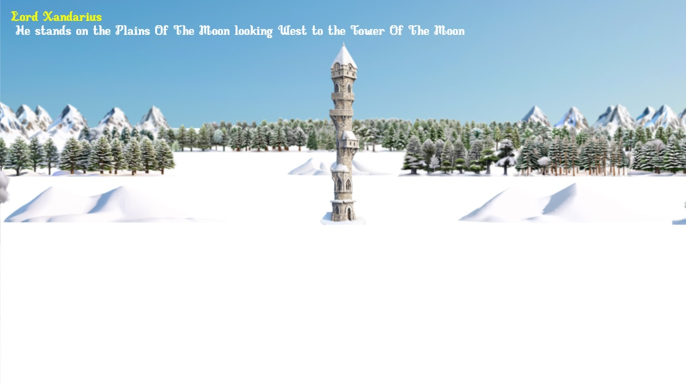
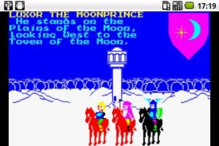

# Lords Of Midnight Map Navigator

This is a JavaScript implementation of [Mike Singleton's Landscaping technique](https://www.icemark.com/tower/landscaping.htm).

To navigate, use the arrow keys, or tap on the top, left or right of the image.

This is a map navigator and not a full game.

It uses the original map from the 1984 game, [The Lords Of Midnight](https://en.wikipedia.org/wiki/The_Lords_of_Midnight).

Each map location uses a generative AI image created using [Stable Diffusion](https://github.com/lllyasviel/stable-diffusion-webui-forge) with the [layer diffusion](https://github.com/lllyasviel/sd-forge-layerdiffuse) for transparency. Some images were created using txt2img, others using img2img.

*wanted - orginal LOM font
